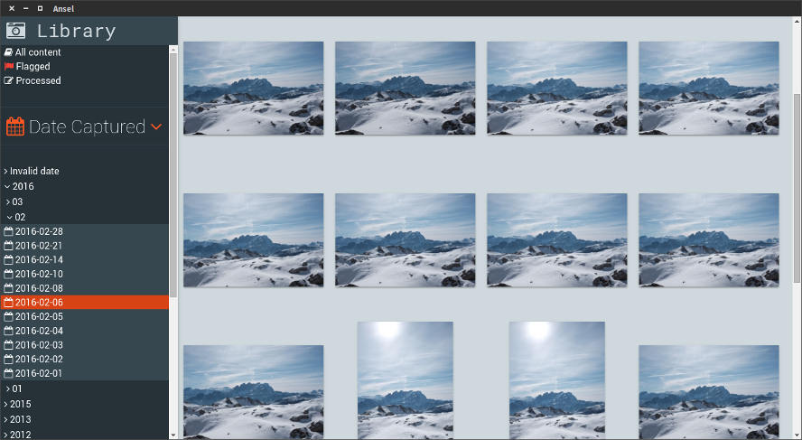

# Ansel



## Prerequistes

In order to be able to run, ansel requires the following libraries:

**Ubuntu trusty 14.04 LTS**

`sudo apt-get install libudev-dev libraw9`

**Ubuntu wily 15.10**

`sudo apt-get install libudev-dev libraw10`

## Build from sources

```
sudo npm install -g gulp
npm install
gulp
```
